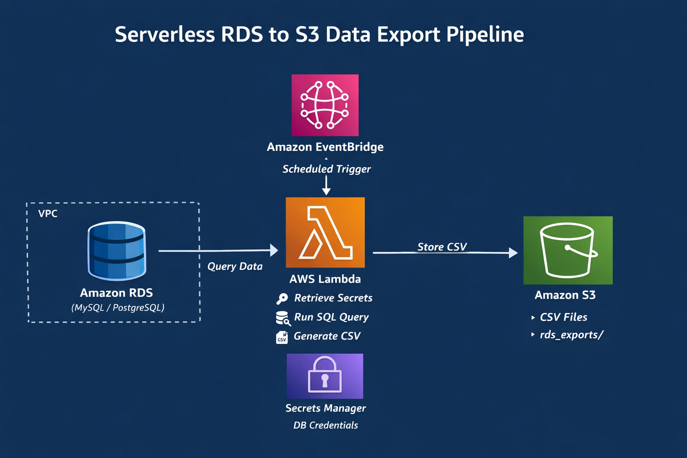

# 🚀 Serverless RDS to S3 Data Export Pipeline

**Status:** Completed
**Type:** Hands-on AWS Cloud Project
**Focus:** Serverless • Automation • Data Export • AWS

---

## 📌 Project Overview

This project implements a serverless scheduled data export pipeline that extracts data from Amazon RDS and stores CSV output in Amazon S3 using AWS managed services.

The implementation was built as a hands-on cloud engineering exercise inspired by existing reference documentation and later improved through troubleshooting and automation to create a more modern serverless workflow.

The architecture eliminates manual operational overhead while improving security, scheduling, and maintainability using AWS native services.

---

## Architecture Highlights

* AWS Lambda runs inside the same VPC as Amazon RDS for secure, private connectivity
* Database credentials are retrieved securely from AWS Secrets Manager
* Output files are generated as timestamped CSV files and stored in Amazon S3

---

## 🧩 Problem Statement

Traditional RDS data exports often rely on:

* Long-running EC2 instances
* Deprecated AWS Data Pipeline
* Hard-coded credentials
* High operational and maintenance overhead

These approaches increase cost, security risk, and operational complexity.

---

## 🛠️ Technologies Used

* AWS Lambda – Serverless compute for data extraction
* Amazon EventBridge – Time-based scheduling
* Amazon RDS – Source database (MySQL / PostgreSQL)
* Amazon S3 – CSV storage
* AWS Secrets Manager – Secure credential storage
* Amazon CloudWatch – Logs and monitoring
* IAM, VPC, Security Groups

---

## 🔐 Security Design

* Database credentials stored in AWS Secrets Manager
* IAM permissions were scoped to required service access
* Lambda runs inside a private VPC
* RDS is not publicly accessible
* No secrets are hard-coded in the source code

---

## 🏗️ Architecture

```text
EventBridge
    ↓
AWS Lambda (inside VPC)
    ↓
AWS Secrets Manager
    ↓
Amazon RDS
    ↓
CSV Generation
    ↓
Amazon S3
    ↓
CloudWatch Logs
```

### Architecture Diagram



---

## 📄 Data Flow

1. EventBridge triggers the Lambda function based on schedule
2. Lambda retrieves credentials from Secrets Manager
3. Lambda connects to RDS inside the VPC
4. SQL query runs on the target table
5. Result set is converted into CSV format
6. CSV file is uploaded to Amazon S3 with a timestamped name
7. Logs are written to CloudWatch

---

## Improvements Implemented

Compared with the initial reference approach:

* Implemented the workflow primarily through AWS Console to understand service integration and configuration
* Replaced manual execution with EventBridge-based scheduling
* Integrated AWS Secrets Manager for secure credential retrieval
* Configured Lambda networking inside a VPC for private database access
* Added CloudWatch logging for monitoring and troubleshooting
* Reduced operational overhead using managed AWS services
* Simplified deployment and execution flow

---

## ⚠️ Challenges Faced

### 1. Configuring Secure Connectivity Between Lambda and RDS

**Challenge:**
Lambda was initially unable to connect to the RDS instance.

**Root Cause:**
Lambda networking and security group configuration did not allow database access.

**Resolution:**
Configured Lambda inside the same VPC as RDS and updated Security Group rules to enable secure connectivity.

---

### 2. Managing Database Credentials Securely

**Challenge:**
Avoiding hard-coded credentials while allowing Lambda to authenticate with RDS.

**Root Cause:**
Embedding credentials inside application code creates security and maintenance risks.

**Resolution:**
Integrated AWS Secrets Manager and retrieved credentials dynamically during Lambda execution.

---

### 3. Packaging External Database Dependencies

**Challenge:**
Lambda execution failed because required database libraries were unavailable.

**Root Cause:**
Required Python database packages were not included in the deployment package.

**Resolution:**
Packaged dependencies together with the Lambda deployment artifact.

---

### 4. Configuring IAM Permissions Correctly

**Challenge:**
Lambda execution failed due to insufficient permissions.

**Root Cause:**
Required access for S3 and Secrets Manager was missing.

**Resolution:**
Configured a dedicated Lambda execution role with scoped access for required services.

---

### 5. Scheduling Automated Execution

**Challenge:**
Creating reliable recurring execution without manual intervention.

**Root Cause:**
Trigger configuration and service integration required validation.

**Resolution:**
Configured EventBridge scheduling and validated Lambda invocation.

---

### 6. Exporting Data to S3 in CSV Format

**Challenge:**
Transforming SQL query output into structured export files.

**Root Cause:**
Database records required conversion before storage.

**Resolution:**
Generated CSV output dynamically and uploaded results to Amazon S3.

---

### 7. Debugging Invalid S3 Bucket Name Errors

**Challenge:**
Lambda execution failed during upload.

**Root Cause:**
Bucket configuration contained unintended whitespace.

**Resolution:**
Validated and sanitized runtime inputs before upload.

---

### 8. Managing Runtime Constraints and Cost Efficiency

**Challenge:**
Balancing execution limits while avoiding unnecessary cloud usage.

**Root Cause:**
Serverless execution introduces timeout, memory, and scheduling considerations.

**Resolution:**
Adjusted Lambda memory and timeout configuration and optimized EventBridge execution frequency.

---

### 9. Organizing Output Files Automatically

**Challenge:**
Preventing exported files from overwriting earlier results.

**Root Cause:**
Static filenames caused replacement of previous exports.

**Resolution:**
Implemented timestamp-based naming for generated CSV files.

---

## 📦 Repository Structure

```text
serverless-rds-to-s3-pipeline/
├── lambda/
├── images/
├── docs/
└── README.md
```

---

## 📤 Sample Output

```text
s3://my-rds-export-bucket/rds_exports/
├── employees_20260222_101200.csv
└── employees_20260222_221200.csv
```

---

## 💰 Cost Analysis

| Service         | Cost Impact                 |
| --------------- | --------------------------- |
| EventBridge     | ~$1 per million events      |
| Lambda          | Pay per execution           |
| S3              | Pennies for small CSV files |
| CloudWatch Logs | Negligible                  |
| RDS             | Existing hourly cost        |

**Total cost:** Estimated cost remains minimal for low-frequency scheduled execution.

---

## 📈 Future Enhancements

* Incremental exports using `updated_at`
* Exactly-once delivery using DynamoDB
* SNS alerts on failures
* Glue + Athena integration for analytics
* Terraform / IaC automation
* CDC-based near real-time ingestion

---

## 🧠 Key Learnings

* Serverless networking and VPC integration
* IAM access design and permission troubleshooting
* Secure secret management using AWS Secrets Manager
* Event-driven AWS architectures
* Lambda packaging and dependency management
* Cloud monitoring and debugging
* Designing cost-aware cloud workflows

---

## 🎯 Solution

Design and implement a fully serverless pipeline that:

* Runs on a fixed schedule
* Securely connects to RDS inside a VPC
* Exports relational data as CSV
* Stores output in Amazon S3
* Scales automatically
* Minimizes infrastructure cost for scheduled execution

---
## 🚀 Execution Steps

1. Create RDS instance
2. Store credentials in Secrets Manager
3. Configure Lambda inside VPC
4. Attach IAM permissions
5. Configure EventBridge schedule
6. Execute export
7. Validate CSV output in S3
8. Review CloudWatch logs
---

## 🏁 Conclusion

This project demonstrates practical experience designing and implementing serverless AWS workflows using managed services and event-driven architecture concepts.

The implementation focused on secure connectivity, automation, monitoring, and operational simplicity while improving upon an initial reference design through hands-on experimentation and troubleshooting.
