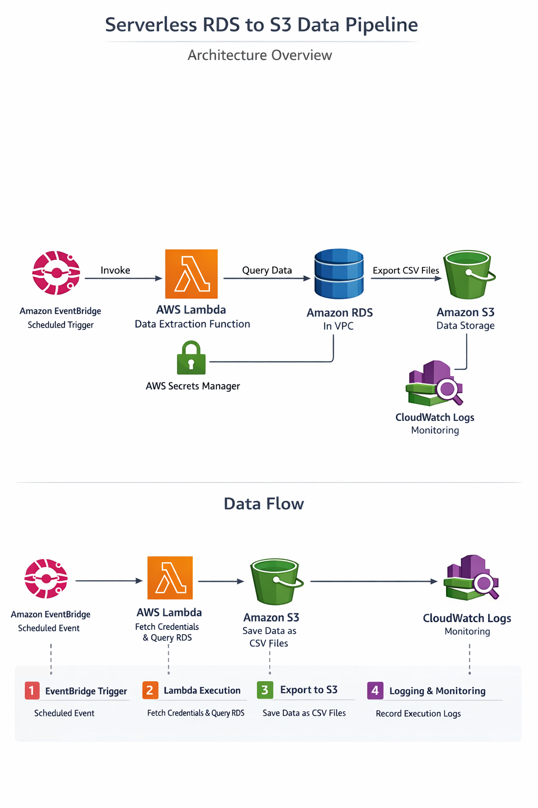

# Architecture

This document describes the architecture and data flow of the **Serverless RDS to S3 Pipeline**.

---

## Overview

1. **Amazon EventBridge** triggers the Lambda function on a fixed schedule.  
2. **AWS Lambda** connects to the RDS database inside a VPC, extracts data, and exports it as CSV into S3.  
3. **AWS Secrets Manager** is used for secure credential storage, ensuring no credentials are hard-coded.  
4. **Amazon CloudWatch Logs** captures Lambda execution logs for monitoring.

---

## 🏗️ Architecture Diagram

The high-level architecture:


```text
Amazon EventBridge (Scheduled Trigger)
            ↓
        AWS Lambda
            ↓
        Amazon RDS
            ↓
        Amazon S3

---

# Visual Diagrams





